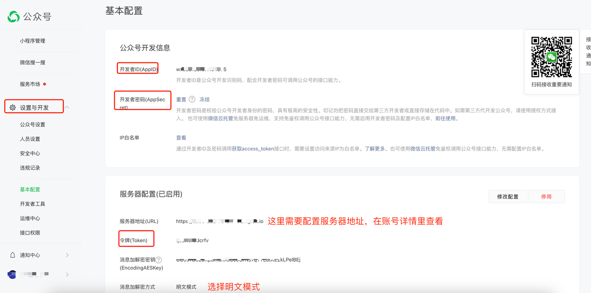

## 公众号协议部署

建议使用已经认证的公众号进行部署，因为未认证的公众号或者个人的订阅号回复等待时间很短，只有 5s，一旦超时就无法回复了。同时公众号协议现在无法获取用户名，所以只能被动回复，不能主动回复

提前准备好参数



## docker 运行(推荐)

#### step1： 拉取镜像

```shell

docker pull aibotk/wechat-assistant

```

#### step2： 启动docker

如果是个人公众号或者没有认证的公众号，需要添加一个变量 `AIBOTK_PERSONAL_MOD=1`，否则可能无法收到消息和发送消息

默认内部的启用端口是 8077，自己做好映射即可

```shell
docker run -d -p 8077:8077 -e AIBOTK_APP_ID="公众号 appid" -e AIBOTK_APP_SECRET="公众号 appsecret " -e AIBOTK_APP_TOKEN="公众号 加密 token" -e AIBOTK_KEY="微秘书apikey" -e AIBOTK_SECRET="微秘书apiSecret" --name=officebot aibotk/wechat-assistant

```

查看docker日志

```
docker logs  officebot
```

## 源码运行

修改文件`src/index.js`文件变量

```javascript
// 如果使用公众号 协议，需要填入以下参数

let appId = '' // 公众号 appid
let appSecret = '' // 公众号 appsecret
let appToken = '' //  公众号加密token
let personalMode = false // 是否是个人号或者没有认证
let outPort = 8077 // 对外暴露的端口号
```

执行命令：`npm run office`

## 关于公众号服务器地址配置

相对对外暴露的默认端口号是 8077，服务器地址由于必须是公网域名，请自行使用内网穿透工具进行映射，
或者放到自己的公网服务器进行解析，直接根路径即可例如：`https://mp.example.com` 即可

也可以使用 [Sealos ](https://sealos.run/) 进行部署，平台直接对外有域名
