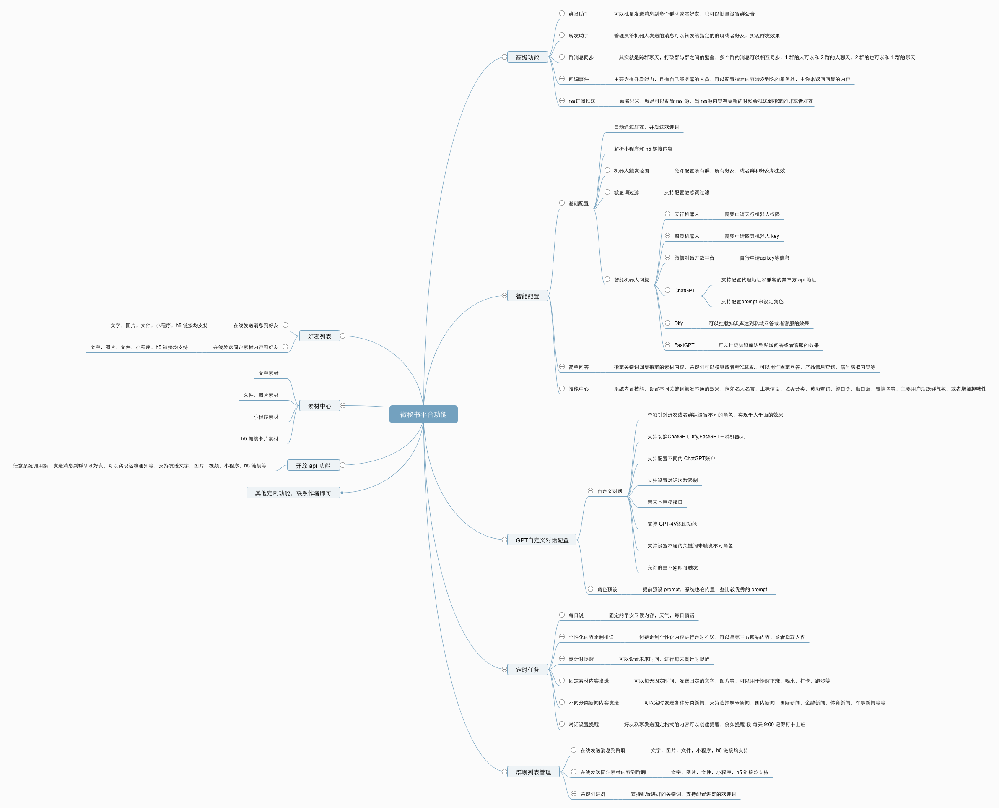

[](https://github.com/wechaty/wechaty)
[](http://nodejs.cn/download/)


[]()

## 智能微秘书

智能机器人配置管理平台，一键接入ChatGPT对话，无缝适配Dify,FastGPT,Coze知识库！

支持群组，个人定义不同的角色，灵活配置各种对话模式，绘图，识图，联网查询，GPTs，语音分析，技能丰富多样！拥有各种定时任务，RSS订阅，倒计时提醒，新闻咨询发送，批量群发，转发，跨群聊天，提醒功能，API发送消息

配合智能微秘书客户端可以一键接入公众号，企业微信，Gitter，Lark，WhatsApp，5G消息等Wechaty所支持的协议

[微秘书官网](https://wechat.aibotk.com)

本项目是搭配智能微秘书平台使用的微秘书客户端，想要使用自己的机器人，必须自己部署微秘书客户端方可。

## 依赖

node 版本 >18

## 项目说明

本项目是基于[wechaty](https://github.com/wechaty/wechaty) 的开源智能机器人项目，更多关于`Wechaty`项目说明及 api 
文档可以移步：[wechaty 介绍](https://wechaty.js.org/docs/howto/)

微秘书部署详细教程链接地址：[微秘书文档](https://help.aibotk.com/?plugin=czw_emDoc&post=5)

## 更多功能说明



### 🌟 群发助手
- 可以批量发送消息到多个群聊或好友，也可以批量设置群公告。

### 🔄 转发助手
- 管理员给机器人发送的消息可以转发给指定的群聊或好友，实现群发效果。

### 🌐 群消息同步
- 跨群聊天，打破群与群之间的壁垒，多个群的消息可以相互同步。1 群的人可以和 2 群的人聊天，反之亦然。

### 📩 回调事件
- 适用于有开发能力且有自己服务器的人员，可以配置指定内容转发到你的服务器，由你来返回回复的内容。

### 📰 RSS订阅推送
- 配置 RSS 源，当 RSS 源内容更新时，会推送到指定的群或好友。

## 智能配置

### ⚙️ 基础配置
- 自动通过好友，并发送欢迎词。
- 解析小程序和 H5 链接内容。
  
#### 🤖 机器人触发范围
- 允许配置所有群、所有好友，或群和好友都生效。

#### 🚫 敏感词过滤
- 支持配置敏感词过滤。

### 🤖 智能机器人回复
- **天行机器人**：需要申请天行机器人权限。
- **图灵机器人**：需要申请图灵机器人 Key。
- **微信对话开放平台**：自行申请 API Key 等信息。
- **ChatGPT**：支持配置代理地址和兼容的第三方 API 地址，支持配置 Prompt 来设定角色。
- **Dify**：可挂载知识库，实现私域问答或客服效果。
- **FastGPT**：同样可挂载知识库，实现私域问答或客服效果。
  
#### 🛠️ 其他机器人
- Qanything
- Coze
- 扣子

### ❓ 简单问答
- 指定关键词回复指定素材内容，关键词可以模糊或精准匹配，可用于固定问答、产品信息查询、暗号获取等。

### 🎉 技能中心
- 系统内置技能，设置不同关键词触发不同效果，例如名人名言、土味情话、垃圾分类、黄历查询等，增加趣味性。

## GPT自定义对话配置

### 💬 自定义对话
- 针对好友或群组设置不同角色，实现千人千面的效果。

🔄 支持切换多种机器人
- ChatGPT, Dify, FastGPT, 扣子, Coze, Qanything 等。

⏳ 支持设置对话次数限制，带文本审核接口。
 
 🎤 语音识别与发送（企微协议支持，需定制开通）。
 
🔑 支持设置不同关键词触发不同角色，无需 @ 即可触发。

🎭 角色预设

- 提前预设 Prompt，系统内置优秀 Prompt。

## 定时任务

### ☀️ 每日说
- 固定早安问候内容、天气、每日情话。

### 📅 个性化内容定制推送
- 定制个性化内容进行定时推送，可以是第三方网站内容或爬取内容。

### ⏲️ 倒计时提醒
- 设置未来时间进行每天倒计时提醒。

### 📦 固定素材内容发送
- 每天固定时间发送固定文字、图片等，用于提醒下班、喝水等。

### 📰 不同分类新闻内容发送
- 定时发送各种分类新闻，如娱乐新闻、国内新闻、国际新闻等。

### 🔔 对话设置提醒
- 好友私聊发送固定格式的内容可创建提醒，例如“提醒我每天9:00记得打卡上班”。

## 群聊列表管理

💬 在线发送消息到群聊
- 支持文字、图片、文件、小程序、H5链接等格式。

📜 在线发送固定素材内容到群聊

🗝️ 关键词进群管理

- 配置进群关键词及欢迎词。

## 好友列表

💌 在线发送消息到好友

## 素材中心

📝 文字素材 
📁 文件、图片素材 
🌐 小程序素材 
🔗 H5链接卡片素材 

## 开放 API 功能

⚙️ 任意系统调用接口发送消息到群聊和好友，支持发送文字、图片、视频等格式。
  
👥 获取所有好友列表和群列表。

## 📞 其他定制功能

图像识别，语音识别，语音发送，自定义机器人接口开放请加入交流群，联系管理员即可

更多详情介绍：[功能概览](https://help.aibotk.com/?plugin=czw_emDoc&post=31)

## 提前准备

### 注册智能微秘书管理账号

1. 注册：[智能微秘书](https://wechat.aibotk.com/#/signup?r=dBL0Bn)

2. 初始化配置文件`小助手配置->基础配置`，修改后保存

3. 个人中心获取`APIKEY`和`APISECRET`，后续配置用到


### 注册天行数据账号

由于本项目大部分定时资讯和一些天气接口来自于天行数据，所以需要提前准备好天行数据的账号，同时申请好相关接口的权限

1、注册: [天行数据](https://www.tianapi.com/source/865c0f3bfa)

2、申请接口权限

必选接口

* [天行机器人](https://www.tianapi.com/apiview/47): https://www.tianapi.com/apiview/47
* [天气](https://www.tianapi.com/apiview/72):https://www.tianapi.com/apiview/72
* [新闻](https://www.tianapi.com/apiview/51) : https://www.tianapi.com/apiview/51 ** (新闻资讯只需要申请这个接口即可，不需要申请具体的分类接口，务必记着)**
* [垃圾分类](https://www.tianapi.com/apiview/97): https://www.tianapi.com/apiview/97

可选接口（如果想使用相应的功能还是必须申请的），但是如果默认使用了天行机器人，以下功能接口无需申请也可以，机器人会直接返回对应信息

* [土味情话](https://www.tianapi.com/apiview/80):https://www.tianapi.com/apiview/80
* [名人名言](https://www.tianapi.com/apiview/92):https://www.tianapi.com/apiview/92
* [星座运势](https://www.tianapi.com/apiview/78):https://www.tianapi.com/apiview/78
* [姓氏起源](https://www.tianapi.com/apiview/94):https://www.tianapi.com/apiview/94
* [顺口溜](https://www.tianapi.com/apiview/54):https://www.tianapi.com/apiview/54
* [老黄历](https://www.tianapi.com/apiview/45):https://www.tianapi.com/apiview/45
* [神回复](https://www.tianapi.com/apiview/39):https://www.tianapi.com/apiview/39
* [歇后语](https://www.tianapi.com/apiview/38):https://www.tianapi.com/apiview/38
* [绕口令](https://www.tianapi.com/apiview/37):https://www.tianapi.com/apiview/37
* [疫情](https://www.tianapi.com/apiview/169):https://www.tianapi.com/apiview/169
* [网络取名](https://www.tianapi.com/apiview/36):https://www.tianapi.com/apiview/36

目前平台只适配了以上天行数据的接口，其他接口暂未适配，如有需要，可以联系定制


## 开始

### 源码运行

需要node版本>16，如果是windows 系统，请使用win10及以上版本

#### Step 1: 安装

克隆本项目，并进入项目根目录执行 `npm install`安装项目依赖

#### Step 2: 配置

`src/index.js`代码中配置`APIKEY`和`APISECRET`

#### Step 3: 运行

执行命令`npm run start`，终端会显示二维码，可以直接扫码，也可以到[智能微秘书](https://wechat.aibotk.com)（小助手配置->登录状态中进行扫码登录）

#### Step 4: 配置相应功能

在[智能微秘书](https://wechat.aibotk.com?r=dBL0Bn)中配置你需要的功能后，给启动的微信发送`更新`关键词即可拉取最新配置（或者你自己设置的更新关键词，初始关键词是`更新`，**
每次修改配置后，请记得一定发送关键词更新配置**


### Docker部署

由于自己构建部分依赖安装比较慢，或者经常会卡住，所以本项目已经提前构建好发布到dockerhub了，直接pull就行了

> 注：使用第三方镜像源加速的。拉取的可能不是最新版本，所以会运行不起来，建议使用官方镜像源，自行切换，不会的可以百度一下


可以在[https://hub.docker.com/r/aibotk/wechat-assistant/tags](https://hub.docker.com/r/aibotk/wechat-assistant/tags) 这里查看到最新的 tag版本

[](https://img.aibotk.com/aibotk/help/7NOgdA20240112114359.png)

拉取完毕的大小大概不到 500M ,如果你拉取的大小超过 1G，大概率是拉取错版本了，请切换成官方源拉取

> 国内用户可以用这个镜像地址进行拉取 registry.cn-hangzhou.aliyuncs.com/aibotk/wechat-assistant:latest

#### step1： 拉取镜像

```shell
# docker pull registry.cn-hangzhou.aliyuncs.com/aibotk/wechat-assistant:latest

docker pull aibotk/wechat-assistant

```

#### step2： 启动docker


```shell
# docker run -d -e AIBOTK_KEY="微秘书apikey" -e AIBOTK_SECRET="微秘书apiSecret" --name=wechatbot registry.cn-hangzhou.aliyuncs.com/aibotk/wechat-assistant:latest

docker run -d -e AIBOTK_KEY="微秘书apikey" -e AIBOTK_SECRET="微秘书apiSecret" --name=wechatbot aibotk/wechat-assistant
```

查看docker日志

```
docker logs  wechatbot
```

### 自行构建docker镜像

需要提前安装 docker 环境，项目根目录执行一下命令

```shell script
docker build -t wechat-assistant .
#web协议
docker run -e AIBOTK_KEY="微秘书apikey" -e AIBOTK_SECRET="微秘书apiSecret" wechat-assistant
```

其他步骤同上

### 使用Gitpod 在线运行测试

现智能微秘书已经适配Gitpod，如果你想测试自己的账号是否能够正常登录，可以在线运行一下测试，此环境仅做测试，不建议作为生产环境使用。

Gitpod 是一个在线和开源平台，用于自动化和现成代码的开发环境。您可以点击下面的按钮在gitpod 上访问wechat-assistant-pro的完整设置。如果您以前从未使用过 gitpod，则需要使用您的 gitHub 帐户登录。

[![GitPod Ready-to-Code][gitpod_img]][gitpod_link]

更多关于Gitpod的信息可以参考: https://wechaty.js.org/2021/02/06/wechaty-getting-started-without-leave-your-browser/

### Railway部署

[](https://railway.app/template/w6W1s-?referralCode=2rS9In)

环境变量：AIBOTK_KEY和AIBOTK_SECRET必填

### ipad协议运行

查看：[如何使用padlocal协议](https://github.com/leochen-g/wechat-assistant-pro/issues/61)

### 企微协议运行

查看：[如何使用企微部署](https://github.com/leochen-g/wechat-assistant-pro/issues/60)

### 公众号部署

#### 提前准备

1、必须有一个备案好的域名，绑定映射到容器的端口8077，否则无法在公众号后台配置
2、需要在公众号开发配置里添加运行容器的ip白名单，否则消息无法调通

#### 启动命令

参数说明

AIBOTK_KEY: 微秘书apikey

AIBOTK_SECRET: 微秘书apiSecret

OFFICE_APPID: 公众号AppId

OFFICE_TOKEN: 公众号自己随机写的token

OFFICE_IS_PERSON: 是不是个人订阅号或者未认证的服务号，如果是个人号或者未认证的服务号，3s内必须响应消息，否则无法发出消息。如果是认证的服务号，使用的是客服回复接口，不受回复时间限制

认证服务号或者认证非个人订阅号启动方式

```
docker run -d -e OFFICE_APPID="公众号AppId" -e OFFICE_TOKEN="公众号自定义的Token" -e OFFICE_IS_PERSON="false"  -e AIBOTK_KEY="微秘书apikey" -e AIBOTK_SECRET="微秘书apiSecret" -p 8077:8077 --name=officebot registry.cn-hangzhou.aliyuncs.com/aibotk/wechat-assistant:latest
```

个人订阅号或者非认证服务号启动方式

```
docker run -d -e OFFICE_APPID="公众号AppId" -e OFFICE_TOKEN="公众号自定义的Token" -e OFFICE_IS_PERSON="true"  -e AIBOTK_KEY="微秘书apikey" -e AIBOTK_SECRET="微秘书apiSecret" -p 8077:8077 --name=officebot registry.cn-hangzhou.aliyuncs.com/aibotk/wechat-assistant:latest
```


## 体验与交流

扫描下方二维码，添加智能微秘书，体验以上所有功能，发送加群关键词即可进入交流群，如果微信无法添加可以先进QQ群：1045575073


## 更新日志

[更新日志](./CHANGELOG.md)

## 常见问题处理

参见[https://help.aibotk.com](https://help.aibotk.com/?plugin=czw_emDoc&post=5)

## 面板预览


## 功能预览


个人定时与群定时任务


## 免责声明

本软件依据github上开源项目 Wechaty

通过简单的设置UI和交互，运行IM机器人。

请遵守国家法律政策，请勿用于非法犯罪行为！

请合理使用，一切不良行为和后果均与作者无关！

本项目不参与解析任何底层代码，只是适配层，所有底层协议均为第三方提供，与本人无关！

[gitpod_img]: https://img.shields.io/badge/Gitpod-Ready--to--Code-blue?logo=gitpod
[gitpod_link]: https://gitpod.io/#https://github.com/leochen-g/wechat-assistant-pro
