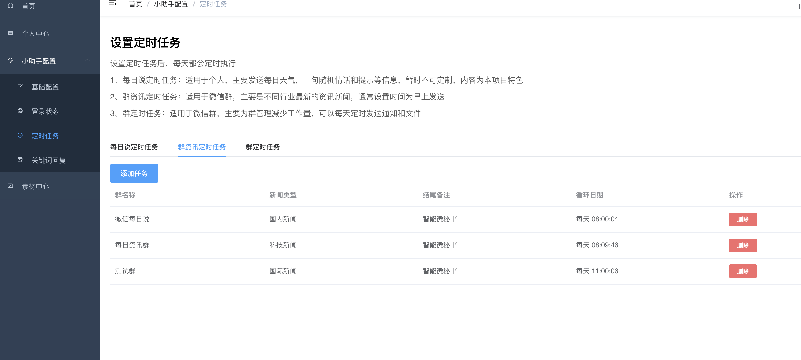

[](https://github.com/wechaty/wechaty)
[](http://nodejs.cn/download/)


[]()

# 最新通知 喜大普奔

由于Wechaty的升级，现已支持所有微信登录，就算你的微信之前不能登录web版，现在也可以用了，赶快来体验吧。

# ~~遗憾的通知~~

uos 协议又可以重新使用了
~~由于UOS桌面版协议微信已经关闭了，没法再继续用桌面版协议登录了，现在只能换回web协议了。可以登录网页版微信的账号可以继续用，不能登录网页版协议的就不能用了。或者你可以申请Wechaty 的ipad local协议的token可以免费试用7天 。申请地址:  https://github.com/padlocal/wechaty-puppet-padlocal~~

## 智能微秘书-插件版 (Wechaty 1.x版本)

让你闲置的微信号成为你的日常小秘书（没有闲置的也没关系，添加我的小助手微信号，她就能成为你的智能微秘书）。

帮你创建私人定时任务，每日提醒，纪念日提醒，当日提醒。当然基础的给女朋友的每日说功能也是必备的，而且小助手版每日说为那些非常优秀的程序员准备了多女朋友定时发送提醒功能。

同时自带微信机器人功能，群资讯消息定时发送，群定时提醒功能，群机器人聊天，垃圾分类，天气查询，土情话查询，老黄历查询，顺口溜查询等众多功能。

此项目直接使用的是Wechaty的面板插件，当然这个插件也是作者开发的，如果有兴趣研究源码，可以移步[插件源码](https://github.com/leochen-g/wechaty-web-panel) ，觉得有用记得点个star

## 依赖

node 版本 >16

## 项目说明

本项目是基于[wechaty](https://github.com/wechaty/wechaty) 的个人开源智能机器人项目，更多关于`wechaty`项目说明及 api
文档可以移步：[wechaty 介绍](https://wechaty.js.org/docs/howto/)

## 更多功能说明

- [x] 微信每日说,定时给女朋友发送每日天气提醒，以及每日一句

* 定时提醒

- [x] 当天定时提醒 例："提醒 我 18:00 下班了，记得带好随身物品"
- [x] 每天定时提醒 例："提醒 我 每天 18:00 下班了，记得带好随身物品"
- [x] 指定日期提醒 例："提醒 我 2019-05-10 8:00 还有 7 天是女朋友生日了，准备一下"

* 智能机器人

- [x] 天行机器人
- [x] 图灵机器人
- [x] 腾讯闲聊机器人
- [ ] 更多

* 群定时任务

- [x] 群新闻定时发送
- [x] 群消息定时发送
- [ ] 更多功能等你来 pr

* 关键词

- [x] 关键词加好友
- [x] 关键词加群
- [x] 关键词回复
- [x] 关键词事件
    - [x] 天气查询 例："上海天气"
    - [x] 垃圾分类 例："?香蕉皮"
    - [x] 名人名言 例： "名人名言"
    - [x] 老黄历查询 例： "黄历 2019-6-13"
    - [x] 姓氏起源 例： "姓陈"
    - [x] 星座运势 例： "\*双子座"
    - [x] 神回复 例： "神回复"
    - [x] 获取表情包 例： "表情包你好坏"
    - [x] 获取美女图 例： "美女图"
    - [x] 群合影 例： "群合影"
    - [x] 牛年头像 例： "牛气冲天"
    - [ ] 更多待你发现
- [x] 进群自动欢迎
- [x] 加好友自动回复

* 自动更新配置文件，无需重启

- [x] 默认给机器人发送 ‘更新’ 触发拉取新配置文件操作，可在面板`小助手配置->关键词回复->关键词事件`进行修改关键词

* 特色功能

- [x] 群合影
- [x] 主动发送消息
- [x] 主动更新配置
- [x] 主动同步好友和群列表
- [x] 多群消息同步

更多详情介绍：[传送门](https://www.xkboke.com/web-inn/secretary/client.html#%E5%B0%8F%E5%8A%A9%E6%89%8B%E5%8A%9F%E8%83%BD%E4%B8%80%E8%A7%88)

## 提前准备

### 注册智能微秘书管理账号

1. 注册：[智能微秘书](https://wechat.aibotk.com/#/signup)

2. 初始化配置文件`小助手配置->基础配置`，修改后保存

3. 个人中心获取`APIKEY`和`APISECRET`，后续配置用到


### 注册天行数据账号

由于本项目大部分定时资讯和一些天气接口来自于天行数据，所以需要提前准备好天行数据的账号，同时申请好相关接口的权限

1、注册: [天行数据](https://www.tianapi.com/source/865c0f3bfa)

2、申请接口权限

必选接口

* [天行机器人](https://www.tianapi.com/apiview/47)
* [天气](https://www.tianapi.com/apiview/72)
* [新闻](https://www.tianapi.com/apiview/51)
* [垃圾分类](https://www.tianapi.com/apiview/97)

可选接口（如果想使用相应的功能还是必须申请的），但是如果默认使用了天行机器人，以下功能接口无需申请也可以，机器人会直接返回对应信息

* [土味情话](https://www.tianapi.com/apiview/80)
* [名人名言](https://www.tianapi.com/apiview/92)
* [星座运势](https://www.tianapi.com/apiview/78)
* [姓氏起源](https://www.tianapi.com/apiview/94)
* [顺口溜](https://www.tianapi.com/apiview/54)
* [老黄历](https://www.tianapi.com/apiview/45)
* [神回复](https://www.tianapi.com/apiview/39)
* [歇后语](https://www.tianapi.com/apiview/38)
* [绕口令](https://www.tianapi.com/apiview/37)
* [疫情](https://www.tianapi.com/apiview/169)
* [网络取名](https://www.tianapi.com/apiview/36)

## 开始

### 直接运行

#### Step 1: 安装

克隆本项目，并进入项目根目录执行 `npm install`安装项目依赖

#### Step 2: 配置

`src/index.js`代码中配置`APIKEY`和`APISECRET`

#### Step 3: 运行

执行命令`npm run start`，终端会显示二维码，可以直接扫码，也可以到[智能微秘书](https://wechat.aibotk.com)（小助手配置->登录状态中进行扫码登录）

#### Step 4: 配置相应功能

在[智能微秘书](https://wechat.aibotk.com)中配置你需要的功能后，给启动的微信发送`更新`关键词即可拉取最新配置（或者你自己设置的更新关键词，初始关键词是`更新`，**
每次修改配置后，请记得一定发送关键词更新配置**


### 直接拉取镜像（推荐）

由于自己构建部分依赖安装比较慢，或者经常会卡住，所以本项目已经提前构建好发布到dockerhub了，直接pull就行了，本镜像暂不支持ipad协议，请切换ipad分支

#### step1： 拉取镜像

```shell

docker pull aibotk/wechat-assistant

```

#### step2： 启动docker

以下两个命令自己选择一个执行就行，执行的时候会下载puppet，可能会比较慢，耐心等待一下即可

1、请在项目根目录执行，这个命令是前台执行可以直接看到log日志的，但是没法关闭，只能销毁终端实例

```shell
docker run -e AIBOTK_KEY="微秘书apikey" -e AIBOTK_SECRET="微秘书apiSecret" --name=wechatbot aibotk/wechat-assistant

```

2、这个命令可以在后台运行，多了一个`-d`

```shell
docker run -d -e AIBOTK_KEY="微秘书apikey" -e AIBOTK_SECRET="微秘书apiSecret" --name=wechatbot aibotk/wechat-assistant

```

[如何查看docker日志](https://www.cnblogs.com/mydesky2012/p/11430394.html)

### 自行构建docker镜像

需要提前安装 docker 环境，项目根目录执行一下命令

```shell script
docker build -t wechat-assistant .
#web协议
docker run -e AIBOTK_KEY="微秘书apikey" -e AIBOTK_SECRET="微秘书apiSecret" wechat-assistant
```

其他步骤同上

### 其他协议运行

Wechaty1.x版本暂不支持ipad协议，如需ipad协议运行，请移步：[https://github.com/leochen-g/wechat-assistant-pro-ipad](https://github.com/leochen-g/wechat-assistant-pro-ipad)

## 体验与交流

扫描下方二维码，添加智能微秘书，体验以上所有功能，发送加群关键词即可进入交流群


## 捐助

如果您认为这个项目对你有所帮助，可以扫描以下二维码进行捐助，

不管钱多钱少，您的捐助将会激励我持续开发新的功能！🎉

感谢您的支持！

捐助方法如下：

<div style="display: flex;justify-content: flex-start">


</div>

## 更新日志

[更新日志](./CHANGELOG.md)

## 常见问题处理

参见[https://www.xkboke.com/web-inn/wechatBot/#%E5%B8%B8%E8%A7%81%E9%97%AE%E9%A2%98%E5%A4%84%E7%90%86](https://www.xkboke.com/web-inn/wechatBot/#%E5%B8%B8%E8%A7%81%E9%97%AE%E9%A2%98%E5%A4%84%E7%90%86)

## 面板预览





## 功能预览


个人定时与群定时任务


群消息同步


群合影


## 免责声明

本软件依据github上开源项目 Wechaty

通过简单的设置UI和交互，运行微信机器人。

请遵守国家法律政策，请勿用于非法犯罪行为！

请合理使用，一切不良行为和后果均与作者无关！
